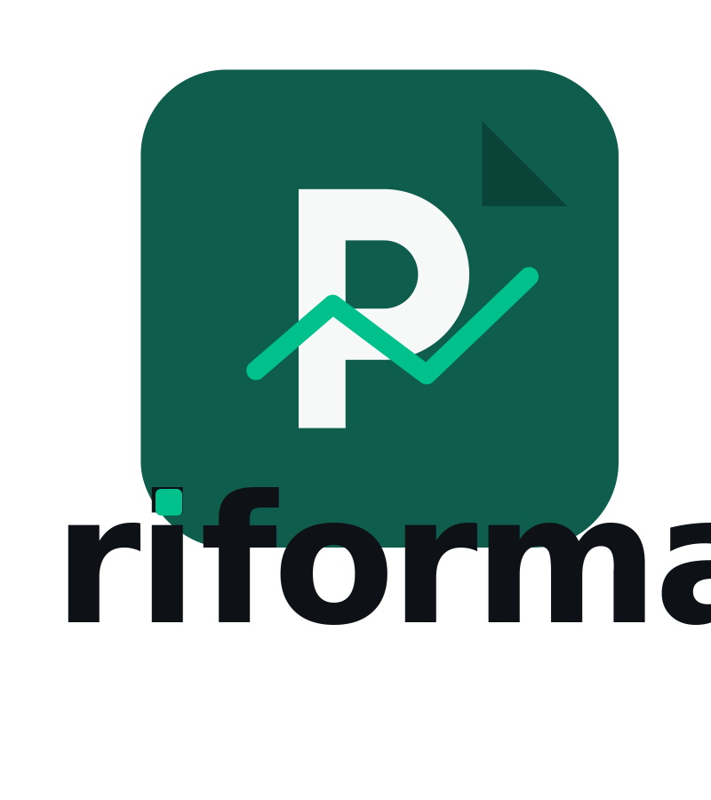

# Riforma — Brand Identity Guide
_Last updated: 2025-09-30_

## 1. Brand Essence
- **Purpose:** Reform how property professionals create, review, and action legal + operational documents.
- **Promise:** Faster, safer decisions through AI-assisted clarity.
- **Personality:** Calm, constructive, meticulous, quietly confident.
- **Values:** Reform, precision, guidance, trust.

## 2. Logo System


### 2.1 Primary Lockup
- Default usage: horizontal wordmark with symbol on the left.
- Minimum width: 140 px (print: 35 mm).
- Clear space: maintain padding equal to the height of the dot over the **i** on all sides.
- Backgrounds: brand whites, subtle tints, or photography with ≥ 70% brightness.

### 2.2 Symbol (Monogram)

- Use for favicons, app icons, avatars, or when space < 140 px wide.
- Maintain a 1:1 aspect ratio; minimum size 24 px.
- Can sit inside circular or rounded-square containers if needed.

### 2.3 Stacked Lockup

- Secondary option for vertical formats or square canvases.
- Minimum width: 120 px.

### 2.4 Don’ts
- Don’t recolor the wordmark or symbol (always primary `#0F5E4D` + accent `#00C08B`).
- Don’t apply drop shadows, outlines, or gradients.
- Don’t rotate, stretch, or mask the logos.

## 3. Color Palette
| Role | Hex | Usage |
| --- | --- | --- |
| Primary | `#0F5E4D` | Brand wordmark, primary buttons, navigation backgrounds |
| Primary Dark | `#0B4237` | Hover states, dark mode canvas |
| Accent | `#00C08B` | AI highlights, calls-to-action, focus rings |
| Ink | `#0E1116` | Headlines, body text on light backgrounds |
| White | `#FFFFFF` | Surface + type on dark backgrounds |
| Subtle Tint | `#0F5E4D0D` | Panels, charts, diagrams |
| Subtle Border | `#0F5E4D33` | Dividers, cards, inputs |

**Gradients (optional):** linear 135° `#0F5E4D` → `#00C08B` for hero sections and data visualisation accents.

## 4. Typography
- **Brand Display:** General Sans (Inter substitute when unavailable). Use 600–700 weight for hero headlines.
- **UI / Body:** Inter with system fallbacks (400 regular, 600 medium, 700 bold).
- **Scale (px):** 12 · 14 · 16 · 18 · 20 · 24 · 28 · 32 · 40 · 48. Rem equivalents follow this scale for responsive typography.
- **Line height:** 140% for body, 120% for display.
- **Case:** Sentence case preferred; ALL CAPS reserved for compact badges.

## 5. Layout & Spacing
- **Core unit:** Height of the dot above the **i** (`x`). Use multiples of `x` to space logo, modules, and components.
- **Grid:** 12-column fluid grid, 24 px gutters desktop, 16 px mobile.
- **Corner radius:** sm 6 px, md 12 px, lg 20 px, xl 28 px.
- **Elevation:**
  - Layer 1: no shadow.
  - Layer 2 (cards): `0 6px 18px rgba(14,17,22,0.08)`.
  - Layer 3 (modals): `0 16px 40px rgba(14,17,22,0.12)`.

## 6. Imagery & Illustration
- **Photography:** Soft daylight property shots, focus on spaces being adapted or improved.
- **Illustration:** Use geometric forms that echo the symbol’s cut angles. Accent strokes at 2 px.
- **Data Viz:** Primary base with accent highlight; rounded corners on charts.

## 7. Iconography & UI Tokens
- Line icons with rounded terminals, 2 px stroke.
- Use accent `#00C08B` to signify AI states or active recommendations.
- Empty states pair iconography with concise copy (max 2 sentences).

## 8. Motion & Interaction
- Default transitions: 150–220 ms ease-out.
- Buttons: scale 1.02 + subtle color lift on hover.
- AI suggestions: pulse accent glow for 400 ms when new insight arrives.
- Respect reduced-motion preferences by disabling scaling/pulsing effects.

## 9. Voice & Messaging
- Tone: calm, precise, supportive.
- Keywords: reform, streamline, clarify, implement, insight.
- Taglines:
  - "Reform how property decisions get made."
  - "From paperwork to progress."
- Microcopy pattern: Verb-first, finish with expected outcome ("Generate new addendum" → "Review addendum draft").

## 10. Applications
- **Product UI:** Horizontal lockup in navigation; symbol in compact headers.
- **Documents & Reports:** Stacked lockup on cover, primary color header band.
- **Marketing Collateral:** Pair hero photography with gradient overlay, accent call-to-action.
- **Favicon & App Icon:** Use exported symbol (`logos/riforma-icon.svg`) with 12 px padding on all sides.

## 11. File Inventory
- `logos/riforma-horizontal.svg` — primary lockup.
- `logos/riforma-icon.svg` — symbol/monogram.
- `logos/riforma-stacked.svg` — vertical lockup.
- `logos/riforma-favicon.svg` — favicon-ready asset.

For additional export sizes (PNG @1x/@2x/@3x) run:
```bash
npx svgexport logos/riforma-horizontal.svg dist/riforma-horizontal.png 280:1080
```
_Adjust width/height as required._

## 12. Governance
- Store master assets in the `brand/` directory with versioned updates.
- Review guidelines quarterly or when product positioning shifts.
- Route bespoke usage requests through Brand Design lead.
